# Lab 1: Accessing Data

### Estimated Duration: 30 Minutes

## Overview

In this lab, you will explore the key features of the Power BI service. This introductory session will guide you through authoring reports using Power BI Desktop, creating operational dashboards, and sharing content via the Power BI Service, enabling you to turn data into actionable insights.

## Lab Objectives

- Task 1: Power BI Desktop - Get Data
- Task 2: Adding additional data

### Task 1: Power BI Desktop - Get Data

1. On your virtual machine, open the **Power BI Desktop**.

    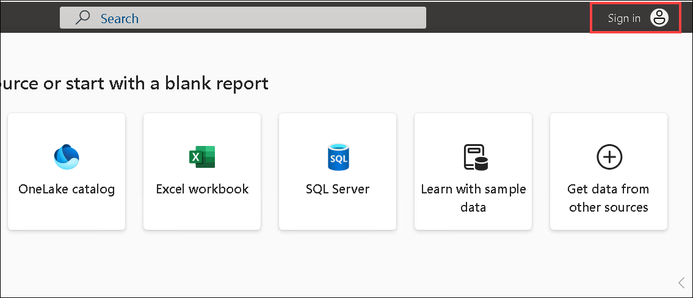
 
1. On the **Power BI Desktop** home screen, click on **Sign in** in the top-right corner to log into your Microsoft account.

     

1. On the **Enter your email address** screen, enter **Email/Username: <inject key="AzureAdUserEmail"></inject>** **(1)** and click **Continue (2)** to proceed with sign-in.

   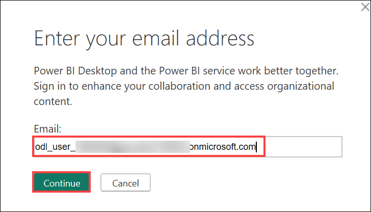

1. After selecting continue, it will again ask you to sign in. You'll see the Sign in to Microsoft tab. Here, enter your credentials:

   - Email/Username: <inject key="AzureAdUserEmail"></inject>

     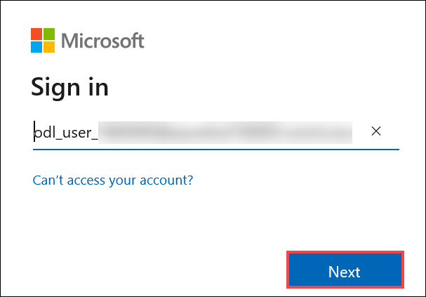

1. Next, provide your password and click on **Sign in**

    - Password: <inject key="AzureAdUserPassword"></inject>  

      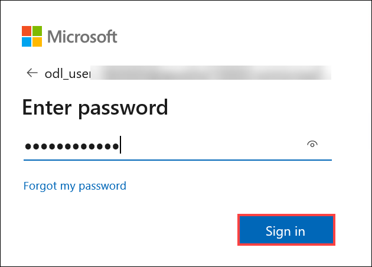

1. On the **Automatically sign in to all the desktop apps and websites on this device?** pop-up, click on **No, this app only.**

     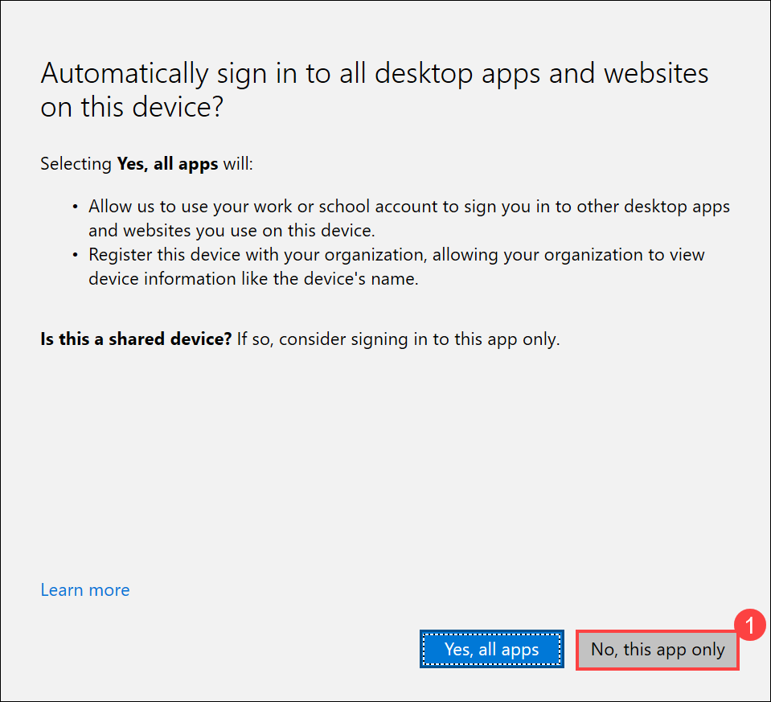

1. From the left menu, click **Options and settings (1)**, and then select **Options (2)** to open the configuration settings.

   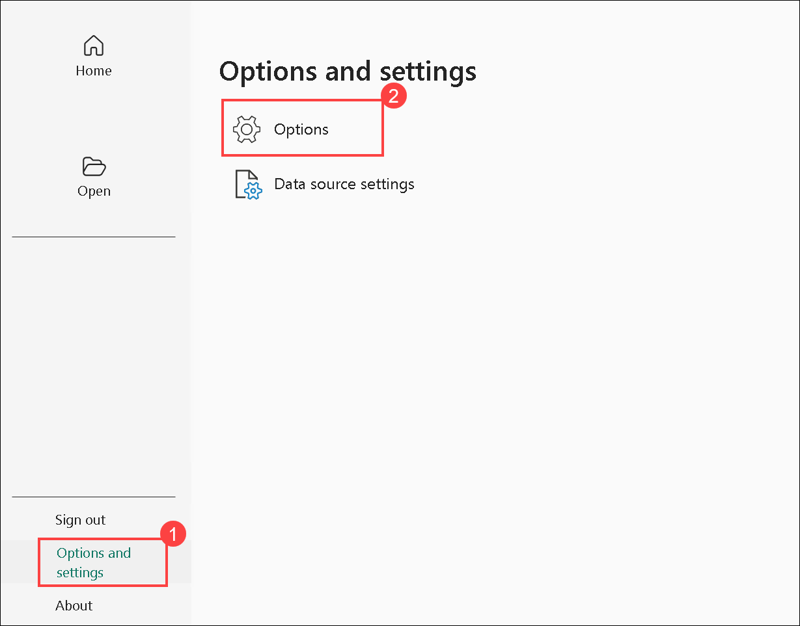

1. On the **Options** page, click on **Preview features (1)** from the left pane under **Global** section. Check the box for **Shape map visual (2)** option and click on **OK (3)** to close the dialog.
 
     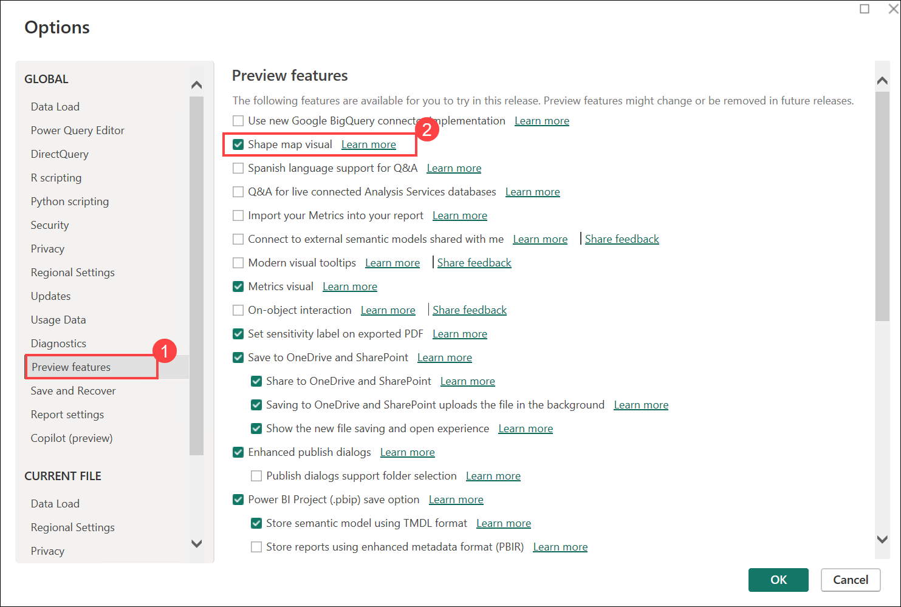

      > **Note:** Click on **OK** when you are prompted with the **Feature requires a restart** pop-up.

      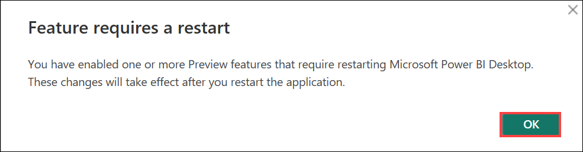
 
1. From the ribbon, click **File**, then from the left menu, click **Options and settings (1)**, and then select **Options (2)** to open the configuration settings.

    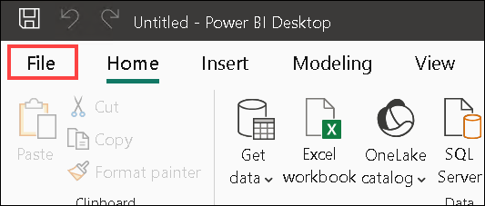
 
    
 
1. On the **Options** page, under the **CURRENT FILE** section in the left pane, select **Regional Settings (1)**. From the **Locale for import** dropdown, choose **English (United States) (2)**. Click **OK (3)** to apply the changes.

   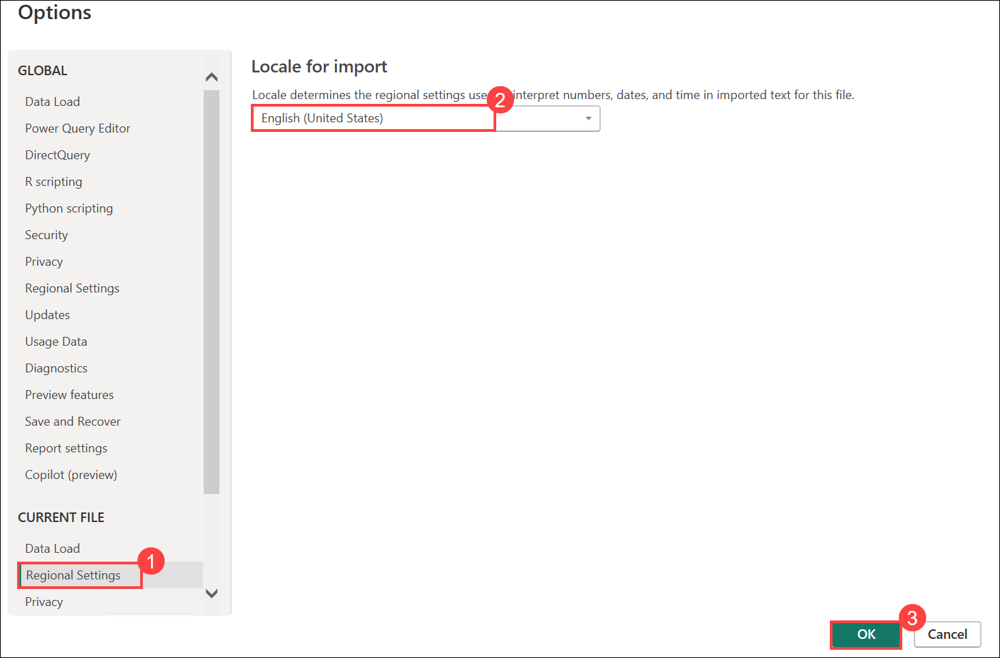
    
1. On the **Home** tab, click **Get data (1)** and from the dropdown menu, select **Text/CSV (2)** under Common data sources.

     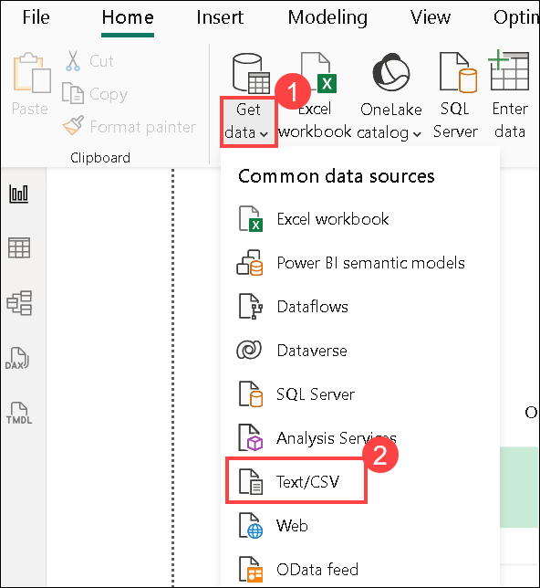

1. In the **Open** dialog box, navigate to the path `C:\DIAD\Attendee\Data\USSales` **(1)**, select the **Sales.csv** file **(2)**, and click **Open (3)**.

    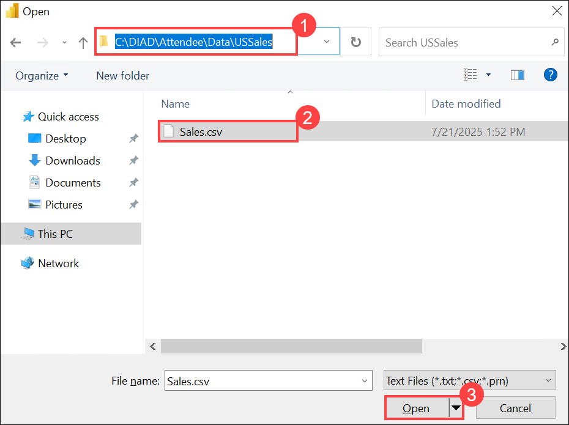

1.  Ensure **Based on first 200 rows (1)** is selected for **Data Type Detection**, then click on **Transform Data (2)** to open Power Query Editor.

    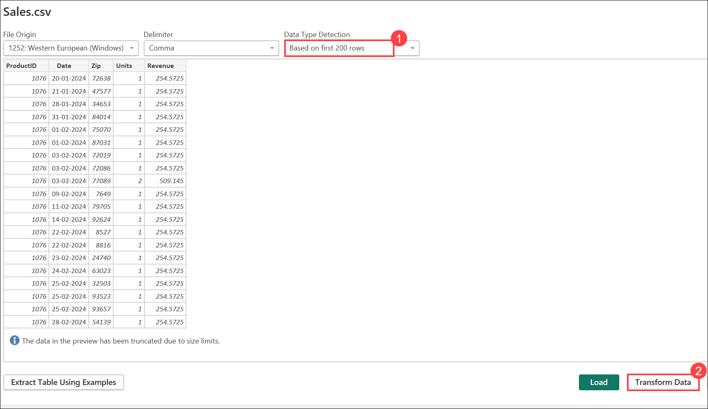
     
     >**Note**: You should be in the Query Editor window as shown in the image below. The Query Editor is used to perform data shaping operations. Notice that the sales file you connected to shows as a query in the left panel. You can see a preview of the data in the center panel. Power BI predicts the data type of each field (based on the first 200 rows) as indicated next to the column header. In the right panel, steps that the Query Editor performs are recorded in the Applied Steps section.    
     
     
     
     >**Note**: You will bring in sales data from other countries as well as performing certain data shaping operations.

1. In the **Power Query Editor**, select the **Zip** column **(1)**, make sure you're on the **Home** tab **(2)**, click **Data Type (3)**, and change it to **Text (4)**.

    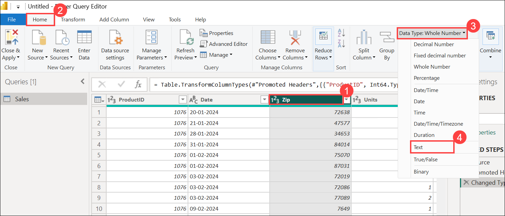
   
1. The **Change Column Type** dialog box opens. Click on the **Replace Current** button, which overwrites Power BI’s predicted data type.

     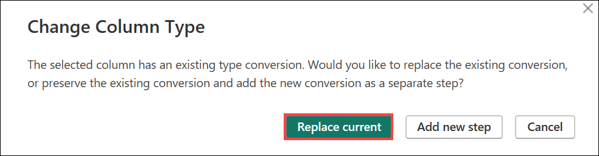
    
1. In the **Power Query Editor**, click **New Source (1)** and then select **Excel Workbook (2)** from the dropdown.

   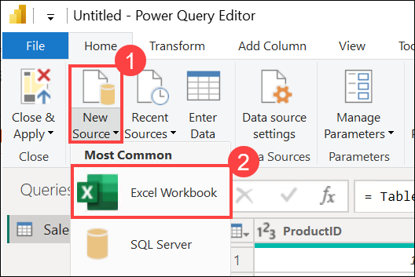
    
1. In the **Open** dialog box, browse to the folder path **C:\DIAD\Attendee\Data\USSales (1)**, select **bi_dimensions.xlsx (2)**, and click **Open (3)**.

    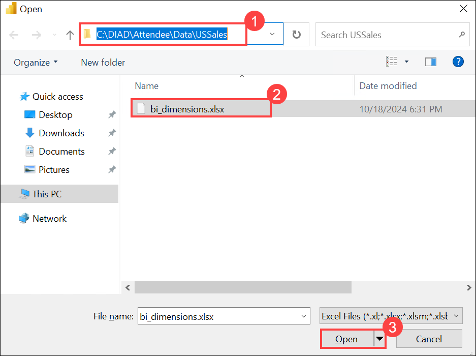
    
1. On **Navigator** dialog box, select **product (1)** from the left pane. In the preview panel, notice that the first row is the headers **(2)**. This is not part of the data.
 
    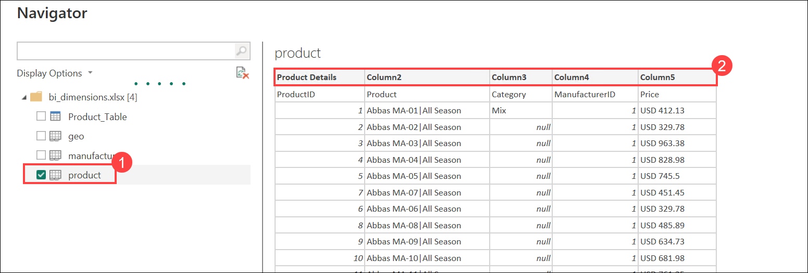

1. Now, deselect **product** from the left panel and click on **Product_Table (1)**. Notice that this table has only the contents of the named table **(2)**. This is the data we need.

   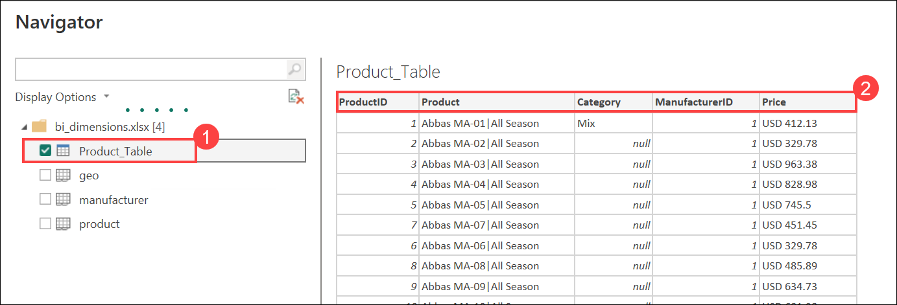
    
     >**Note**: Table names are differentiated from Worksheet names by using different icons.
    
1. From the left panel, click on **geo (1)**. In the preview panel, notice that the first few rows are headers **(2)**. This is not part of the data.

   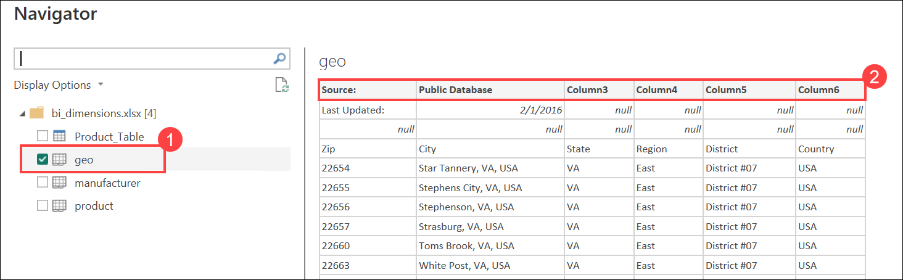

1. From the left panel, click **manufacturer (1)**. In the preview panel, notice that the last couple of rows are footers **(2)** and are not part of the data.

   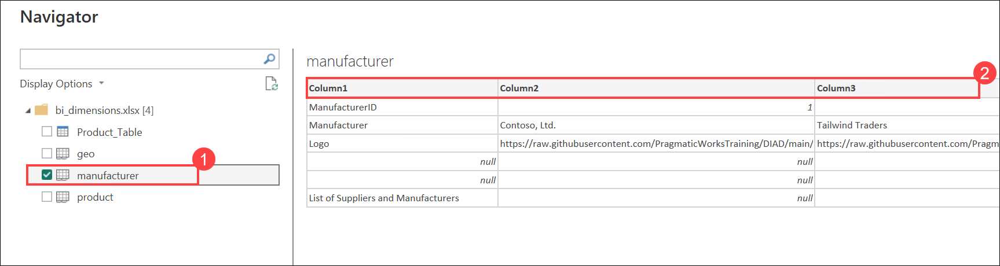

1. In the **Navigator** dialog box, Make sure that **Product_Table**, **geo** and **manufacturer** **(1)** are selected in the left panel and then click on **OK (2)**. 

     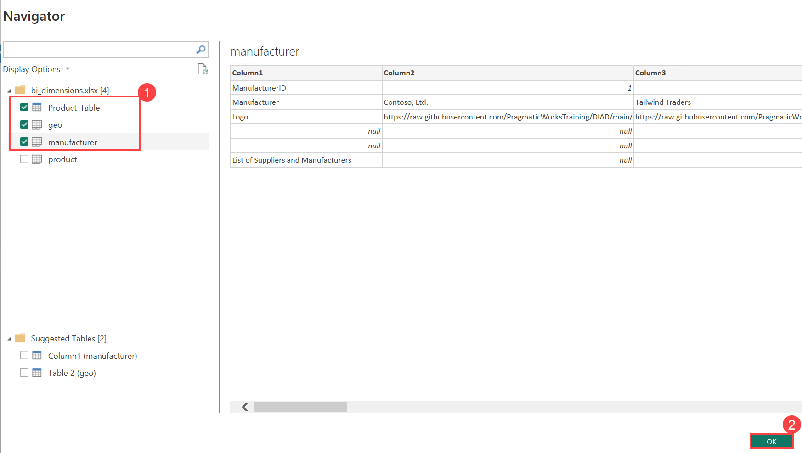

## Task 2: Adding additional data

1. On the **Home** tab of the Query Editor, click on the **New Source (1)** drop-down menu. Select **More… (2)**.

     
    
    > **Note:** The Get Data dialog box opens.

1. In the **Get Data** dialog box, select **Folder (1)** under **All** section and click **Connect (2)**.

     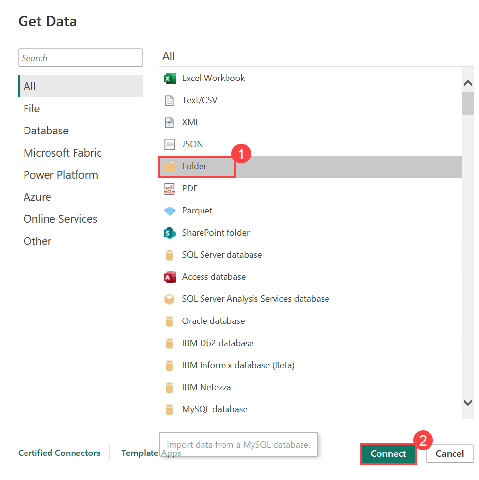
    
1. Click on the **Browse… (1)** button. In the **Browse** for Folder dialog box, navigate to `C:\DIAD\Attendee\Data` and click on the **InternationalSales (2)** folder. Click on **OK (3)** (to close the **Browse for Folder** dialog box). Click on **OK (4)** again.

     

1. Click on **Combine & Transform Data**.
 
     
    
     >**Note**: The data in your file for **Date accessed**, **Date modified**, and **Date created** might be different than the dates displayed in the screenshot. 

1. On the **Combine Files** dialog, ensure the **First File (1)** is selected for Sample file, **comma (2)** is selected for Dilimiter and click on **OK (3)**.

     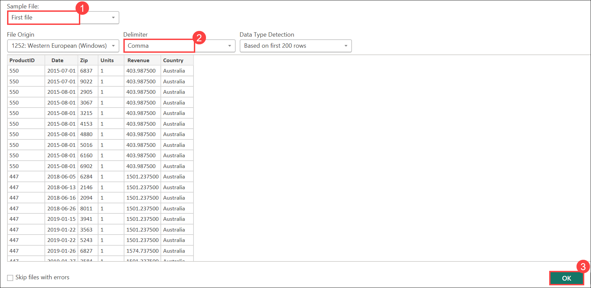

    > **Note:** If you do not see the **Queries** pane on left, click on the > (greater than) icon to expand. 

1. Ensure the Query **InternationalSales** is selected in the left pane. In the **Power Query Editor**, select the **Zip column (1)**, go to the **Home** tab (2), click **Data Type (3)**, and change it to **Text (4)**.

     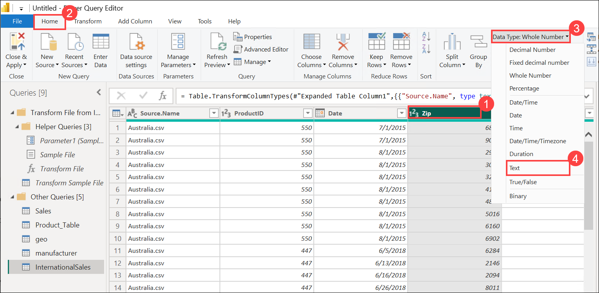

1. The **Change Column Type** dialog box will open. Click on the **Replace Current** button.

     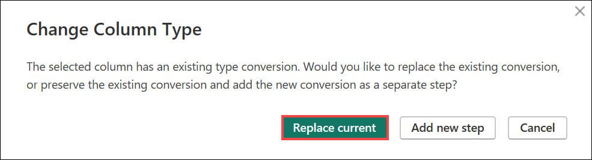

1. Click on the **Source.Name** column and right click and select **Remove** option.

         

1. Next, click the drop-down menu next to the **Country** column to see the unique values. Click on **Load more** to validate that you have data from the various countries included.

         
   
1. Now, you will see the **countries** **Australia, Canada, Germany, Japan, Mexico, and Nigeria**. Click **Select All (1)** and click on **OK (2)**.

   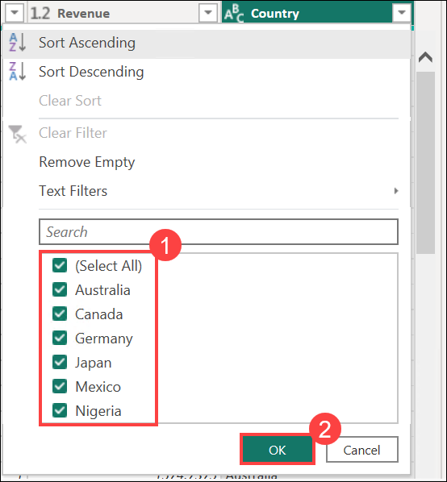

## Summary

In this lab, you have fetched Data and added additional data.

### You have successfully completed the lab!
