# Lab 2 - Data Preparation

### Estimated Duration: 30 Minutes

## Overview

In this lab, you will explore methods to transform data in the data model to ensure it is optimized for reporting. You will perform key transformations such as renaming tables, updating data types, and appending tables to clean and structure the data effectively. These transformations enhance data consistency, improve usability for end users, and streamline the report creation process in Power BI.

## Lab Objectives

- Task 1 - Power BI Desktop – Filling empty values
- Task 2 - Power BI Desktop – Splitting columns
- Task 3 - Power BI Desktop – Renaming columns
- Task 4 - Power BI Desktop – Removing unwanted rows
- Task 5 - Power BI Desktop – Transposing data
- Task 6 - Power BI Desktop – Appending queries

### Task 1 - Power BI Desktop – Filling empty values

1. On the **Query Editor** window, expand **Other Queries (1)** and click each query one by one like **Sales**, **Product_Table**, **geo**, **manufacturer**, and **InternationalSales (2)**.

   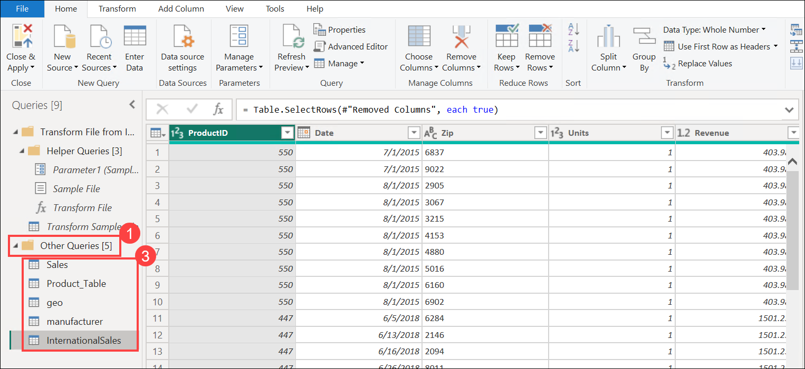

   >**Note**: Please ignore the warning: "There are pending changes in your queries that haven't been applied," if you encounter it in any of the upcoming tasks or labs.
  
1. Navigate to **Query Settings**, and then from the **Properties** section in the right-hand pane, rename the queries as shown below:

   | Initial Name             | Final Name            |
   | ------------------------ | --------------------- |
   | Product_Table            |  `Product`            |
   | geo                      | `Geography`           |
   | manufacturer             | `Manufacturer`        |
   | InternationalSales       | `International Sales` |

   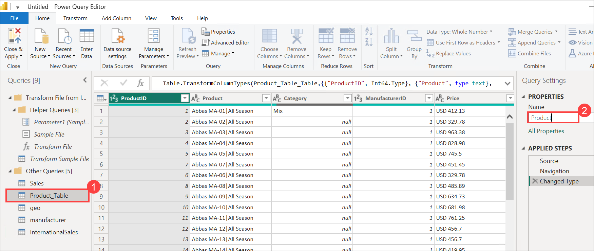

1. From the left pane, select the **Product (1)** query. Then, click the **Category (2)** column. On the ribbon, go to the **Transform (3)** tab, select **Fill (4)**, and choose **Down (5)** to populate empty cells with values from above.

      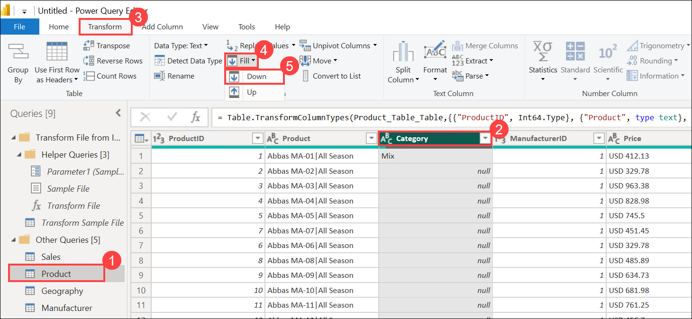

## Task 2 - Power BI Desktop – Splitting columns

In the Product query, notice the Product column. It looks like the product name and product segmentare concatenated into one field with a pipe (|) separator. Let’s split them into two columns. This will be useful when we build visuals, so we can analyze based on both fields.

1. From the left pane, select the **Product (1)** query. Then, click the **Product (2)** column. On the ribbon, go to the **Home (3)** tab, click **Split Column (4)**, and choose **By Delimiter (5)** to separate the column contents.

      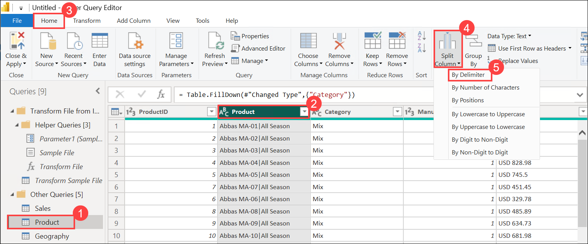

1. In the **Split Column by Delimiter** dialog box, make sure that **Custom (1)** is selected in the **Select or enter delimiter** drop-down menu. Replace the hyphen symbol with **pipe symbol (|)** **(2)** as shown in the image and click on **OK (3)**.

      

## Task 3 - Power BI Desktop – Renaming columns

1. On the **Query Editor** window, click the **Product.1 (1)** column, and then **right-click** next to the column name and click on **Rename… (2)** from the selection menu and **Rename** the field to **Product**.

   

1. Also, click the **Product.2 (1)** column, and then **right-click** next to the column name and click on **Rename… (2)** from the selection menu and **Rename** the field to **Segment**.

   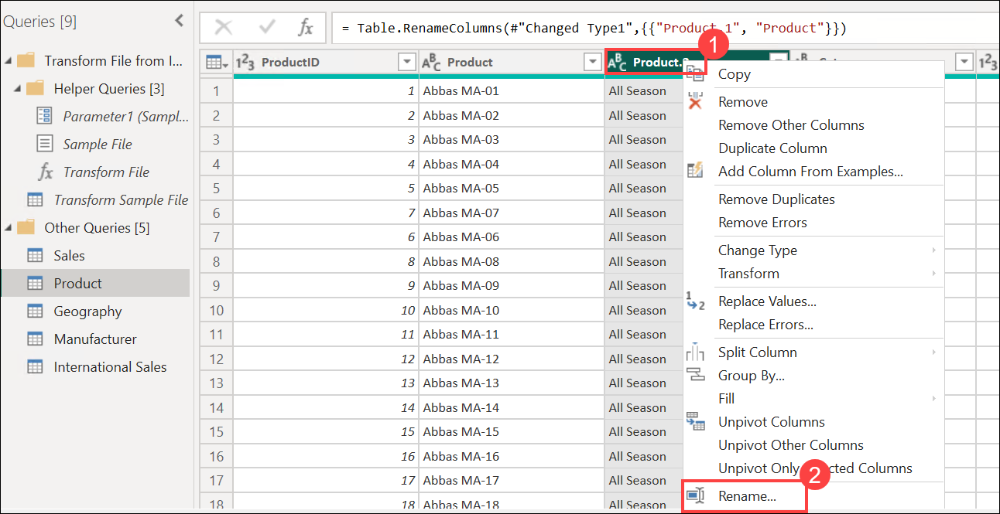
        
## Task 4 - Power BI Desktop – Removing unwanted rows

In the **Geography** query, notice that the first two rows are informational. They are not part of the data. Similarly, in the Manufacturer query, the last couple of rows are not part of the data. Let’s remove them so we have a clean dataset.

1. From the left pane, select the **Geography (1)** query. On the ribbon, click **Remove Rows (2)**, then choose **Remove Top Rows (3)** to clean up the header rows from your dataset.

   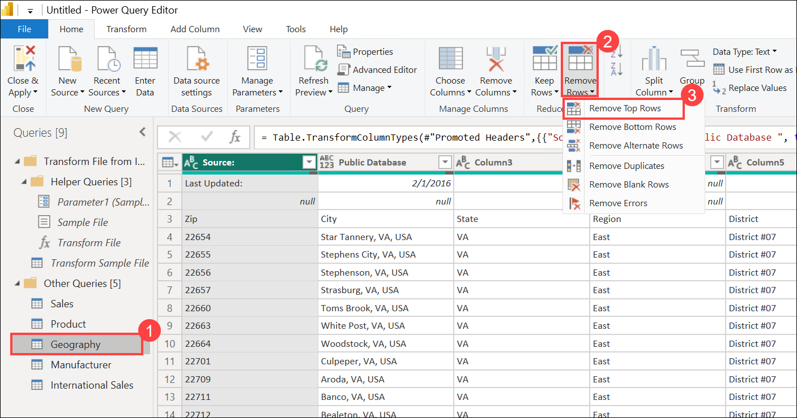

1. In the **Remove Top Rows** dialog box, type `2` in the **Number of rows (1)** field and click **OK (2)**.

    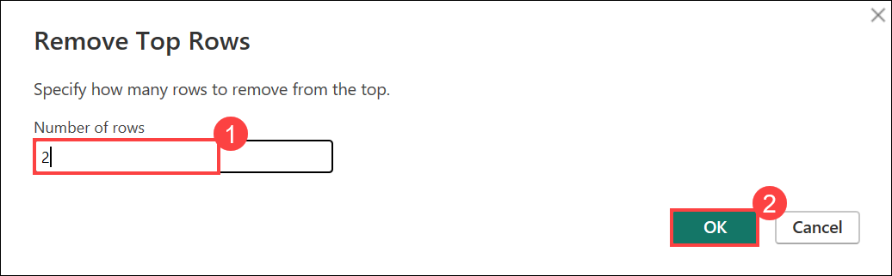

      >**Note**: Notice the first row in the Geography query is now the column header. 

1. With **Geography** query selected in the left panel, on the **Home** tab, click on **Use First Row as Headers** to promote the current first row to column headers.

      

1. With the **Geography** query selected, click on **123 (1)** next to the Zip Column, then choose **Text (2)** from the dropdown list to change the column’s data type. 

      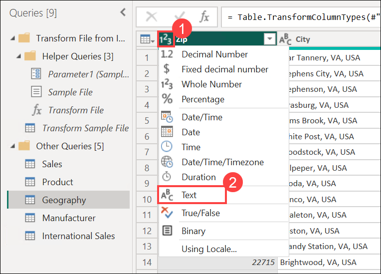
   
1. In the **Change Column Type** dialog box, click on **Replace current** to apply the new data type.

      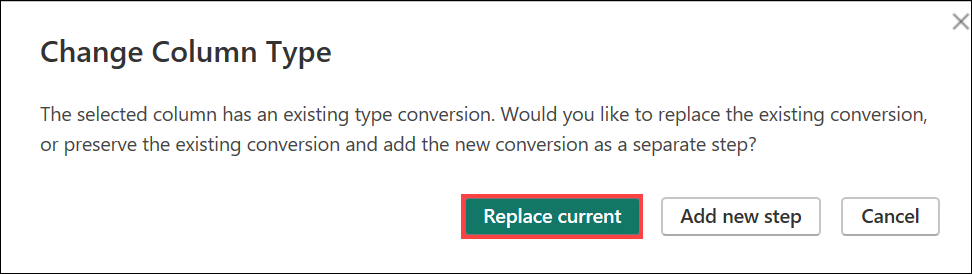

1. From the left pane, select the **Manufacturer (1)** query, go to the **Home (2)** tab. On the ribbon, click **Remove Rows (3)**, then choose **Remove Bottom Rows (4)**.

    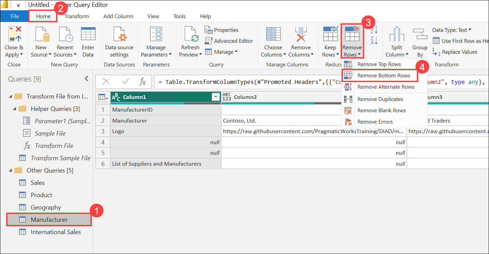

1. In the **Remove Top Rows** dialog box, type `3` in the **Number of rows (1)** field and click **OK (2)**.

    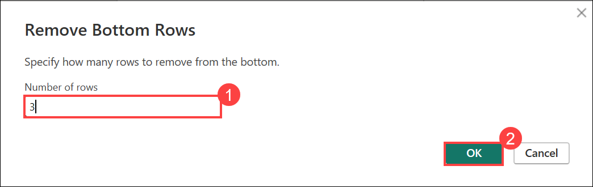
   
## Task 5 - Power BI Desktop – Transposing data

1. From the left pane, select the **Manufacturer (1)** query. On the ribbon, go to the **Transform** tab and click **Transpose (2)** to pivot the table rows into columns.

      

1. With **Manufacturer** query selected in the left panel, on the **Home** tab, click on **Use First Row as Headers** to promote the current first row to column headers. 

      

      > **Note:** Notice that now the **Manufacturer** table is laid out the way we need it with a header and values along columns.

## Task 6 - Power BI Desktop – Appending queries

To analyze the Sales of all countries, it is convenient to have a single **Sales** table. To do this, you need to append all the rows from the **International Sales** query to the **Sales** query.

1. From the left pane, select the **Sales (1)** query. On the **Home (2)** tab, click **Append Queries (3)** from the ribbon to combine data from another table with the current one.

   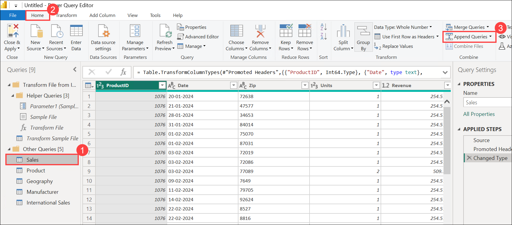

1. In the **Append** dialog, select **Two tables (1)**, choose **International Sales (2)** as the table to append, and click **OK (3)** to merge the data.

      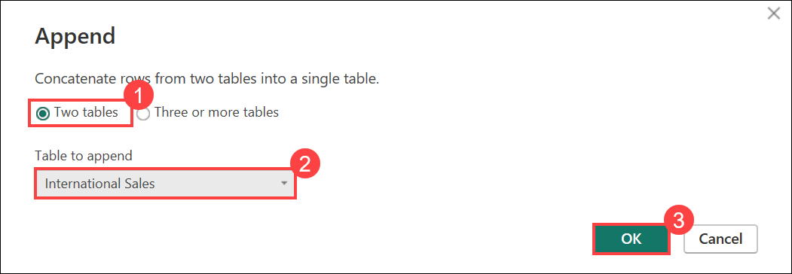
    
      > **Note:** You will now see a new column in the **Sales** table called **Country**. Since the International **Sales** query had the additional column for **Country**, Power BI Desktop added the column to the **Sales** table when it loaded the values from the **International Sales** query. 

1. With the **Sales (1)** query selected, go to the **Add Column (2)** tab on the ribbon, then click **Conditional Column (3)** to create a new column based on specified conditions.

      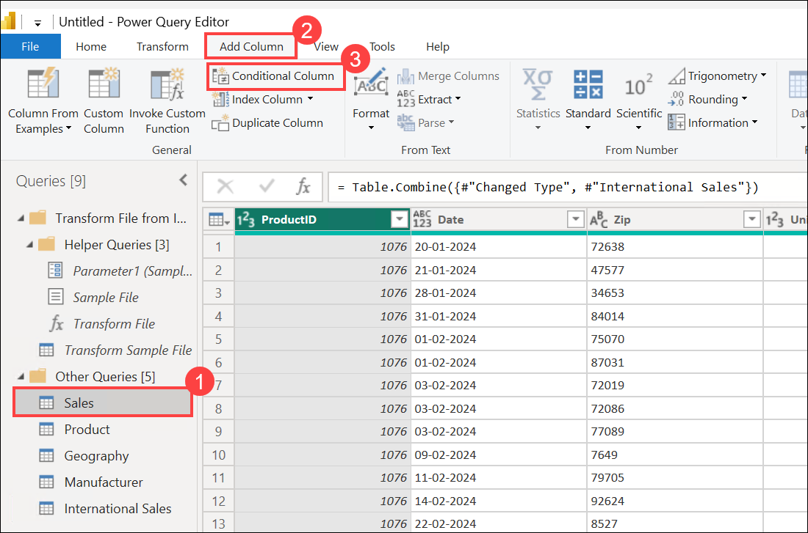
    
1. In the **Add Conditional Column** dialog box, add the below values and click on **OK (8)**:

   - Set the **New column name** to `CountryName` **(1)**.
   - In the condition row, select `Country` from the **Column Name** dropdown **(2)**.
   - Set the **Operator** to `equals` **(3)**.
   - Enter `null` in the **Value** field **(4)**.
   - Set the **Output** to `USA` **(5)**.
   - In the **Else** section, click **Select a column (6)** and choose `Country` **(7)**.

     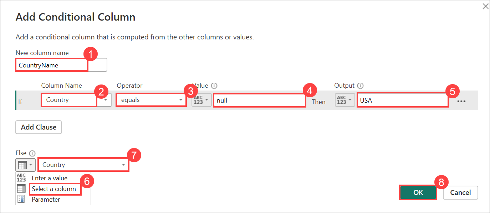

     > **Note:** You will see the **CountryName** column in the Query editor window.   

1. Right-click on the **Country** column and click **Remove** as shown in the figure.
 
   

1. Right-click on the **CountryName (1)** column and rename it to **Country (2)**.

    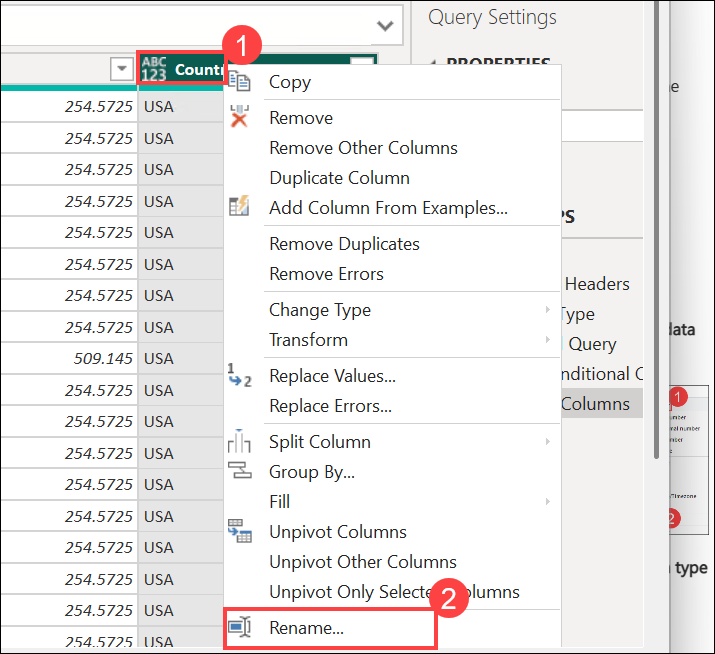

1. From the **Queries** pane, select **Sales (1)**. go to **Home** tab, click on the **Data Type (1)** option, change the **data type** of the **Country** column to **Text (2)**.

     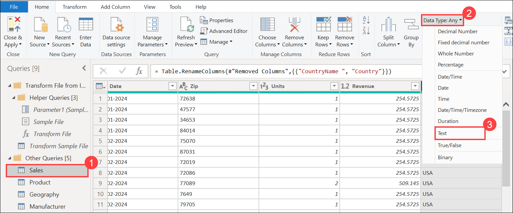

1. In the **Sales** query, select the **Revenue (1)** column. On the ribbon, go to the **Data Type (2)** dropdown and choose **Fixed decimal number (3)** to ensure consistent numeric formatting.

   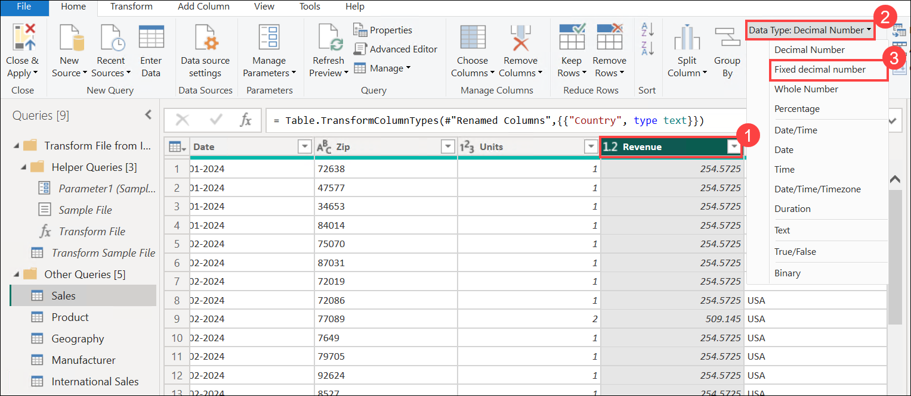

1. On the **Country column**, click on the dropdown next to it **(1)** and select **Load more (2)** to validate you have data from all eight countries. 

   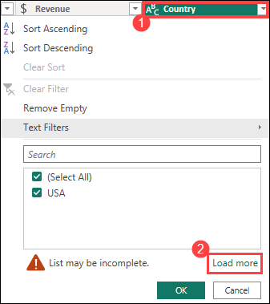

1. Click on **OK** to close this filter.

   

1. Click on the **dropdown arrow (1)** next to **Date** in the **Sales** Query and click on the **Date Filters (2)** option and select **In the Previous…**.

   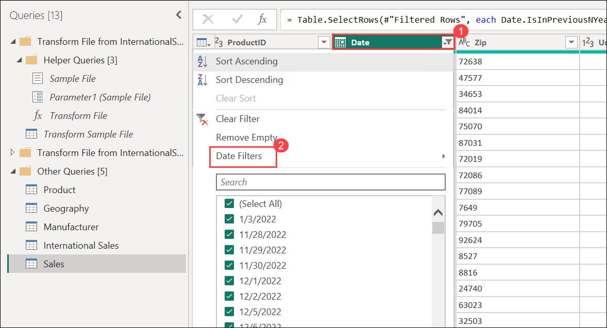
    
1. The **Filter Rows** dialog box opens. Enter **3 (1)** in the text box next to **is in the previous** and select **years (2)** from the drop-down menu. Click on **OK (3)**.

      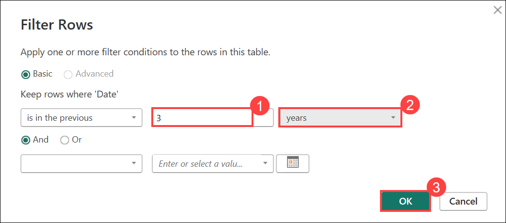

      **Note:** Our dataset covers the period from 2022 to 2024. For our analysis, we will start with the data from the last three years (2022-2024). We don’t yet know how many rows will result. We can filter by year to get the subset.
   
1. From the Queries panel on the left, click on the **International Sales (1)** query. Right-click and select **Enable Load (2)**. This will disable loading International Sales.

   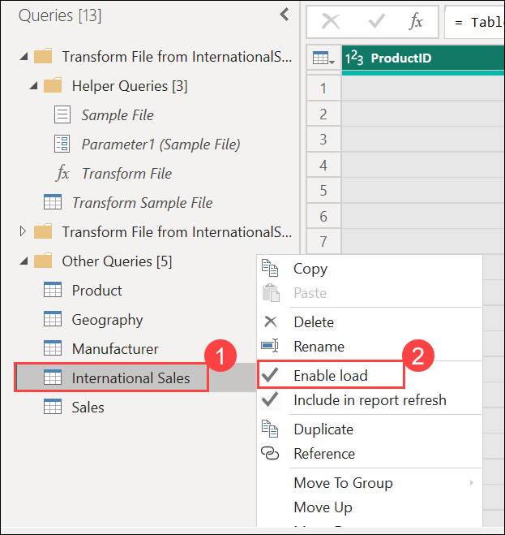
    
     **Note**: The appropriate data from the International Sales table will be loaded into the Sales table each time the model is refreshed. By removing the International Sales table, we are preventing duplicate data from loading into the model and increasing its file size. In some instances, storing very large amounts of data affects the data model performance.
 
1. Click on the **View tab (1)** in the Power Query Editor ribbon, and select **Query Dependencies (2)**.

    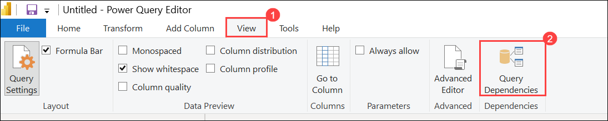

   > **Note:** This opens the **Query Dependencies** dialog box. The dialog box shows the source of each query and its dependencies. For example, we see that the Sales query has a CSV file source and a dependency on the International Sales query. This is useful information to share with your team members.

1. On the **Query Dependencies** dialog box. Click on **Close**.

     

    > **Note:** You have now successfully completed import and data shaping operations and are ready to load the data into the Power BI Desktop data model to visualize the data. 

1. Click on **File (1)** and then click on **Close & Apply (2)**  option. This will close out the Power Query window and apply all changes.

      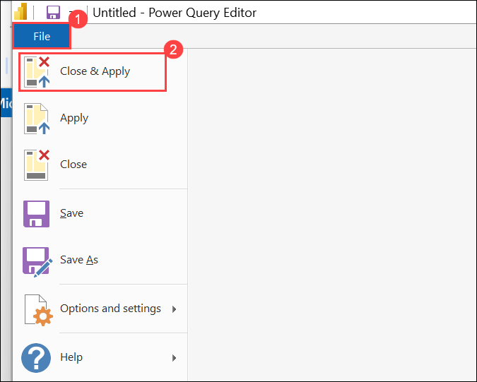
    
    > **Note:** All the data will be loaded in memory in the Power BI Desktop. You will see the progress dialog box with the number of rows being loaded in each table as shown in the Figure.
    
    
    
    >**Note**: **Do not** click on **Cancel**. It may take several minutes to load all the tables.

1. Click on **File** and then click **Save** to save the file.

      

1. In the Save As window, navigate to the `C:\DIAD\Attendee\Reports` folder **(1)**, enter **MyFirstPowerBIModel** as the file name **(2)**, and click **Save (3)**.

   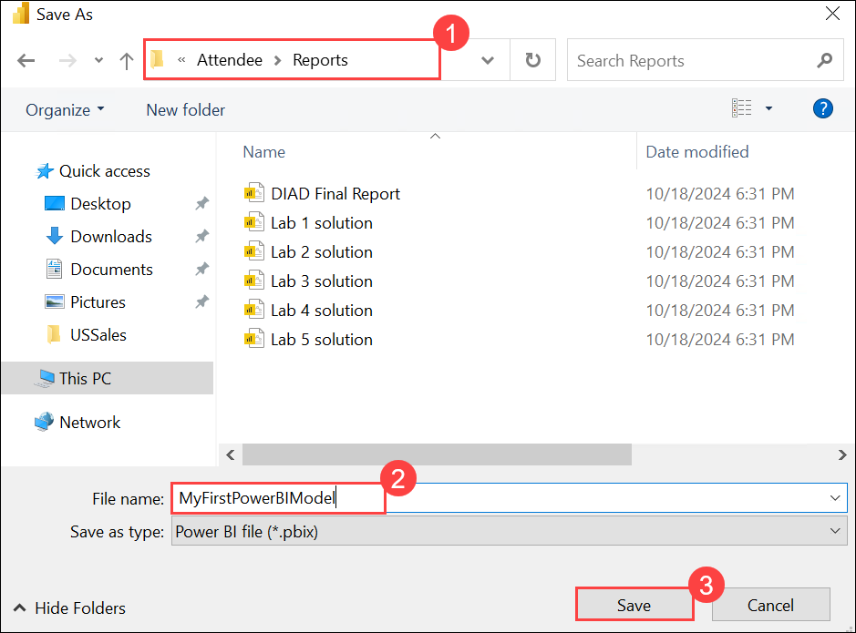

1. On the left panel, click **Table view** ** icon** **(1)** to view the data that was loaded. If you need to open Power Query editor, navigate to **Home -> Transform Data (2**.

   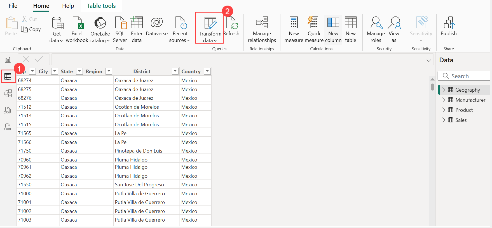

## Summary

In this lab, you have filled empty values, split columns, renamed columns, removed unwanted rows, transposed data, and appended queries.
     
### You have successfully completed the lab!
