# Lab 3 - Data Modeling and Exploration

### Estimated Duration: 60 Minutes

## Overview

This lab provides step-by-step instructions for users to follow, accompanied by screenshots that serve as visual aids. Key sections in the screenshots are highlighted with red or orange boxes to direct the user's attention to essential areas. These highlights help users quickly identify the relevant interface elements, ensuring a smooth and guided learning experience.

## Lab Objectives

- Task 1 - Power BI Desktop - Layout (READ-ONLY)
- Task 2 - Power BI Desktop – Data Exploration 

### Task 1 - Power BI Desktop - Layout (READ-ONLY)

1. On the top of the window, you see the **Home** tab where the most common operations you perform are available.

2. The **Insert** tab in the ribbon allows you to insert shapes, a text box or new visuals.

3. The **Modeling** tab in the ribbon enables additional data modelling capabilities like adding custom columns and calculating measures. 

4. The **View** tab has options to format the page layout. 

5. The **Help** tab provides self-help options like guided learning, training videos and links to online communities, partner showcase and consulting services.

6. On the left side of the window, you have three icons, **Report**, **Data** and **Model**. If you hover over the icons, you can see the tooltips. Switching between these allows you to see the data and the relationships between the tables.

7. The center **white space** is the canvas where you will be creating visuals.

8. The **Visualizations** panel on the right allows you to select visualizations, add values to the visuals,and add columns to the axis or filters.

9. The **Data** window on the right panel is where you see the list of tables which were generated from the queries. Click the :arrow_down_small: icon (downward facing triangle) next to a table name to expand the field list for that table.

      

10. Click on the **Table view** icon on the left side. Expand the **Sales** table in the **Data** pane as shown in the image. Scroll up and down to notice how fast you can navigate through over three million rows.

      
    
11. Click on the **Model** icon on the left panel of Power BI Desktop. You see the tables you have imported along with Relationships. The Power BI Desktop automatically infers relationships between the tables. 
  - A relationship is created between the Sales and Product tables using the **ProductID** column.
  - A relationship is created between the Product and Manufacturer tables using the **ManufacturerID** column.

       
    
### Task 2 - Power BI Desktop – Data Exploration 

1. Click on the **Report (1)** icon on the left panel. Select the **Clustered column chart (2)** visual in **Visualizations** as shown in the screenshot.

      
    
1. From the **Data** section, expand the **Geography** table and then check the box next to the **Country (1)** field. Also, check the box next to the **Revenue (2)** field under the **Sales** Table.

      

1. **Resize** the visual as needed by dragging the edges.

1. Click on the **Model (1)** icon on the left panel to navigate to the Relationship view. Drag the **Zip (2)** field in the **Sales** table to connect the line with the **Zip (3)** field in the **Geography** table.

      

1. On the New relationship dialog, click **Save** to create the relationship.

   

    >**Note:** Ignore the warnings.

1. Click on the **Report** icon on the left pane. In the **Data** section, click on the **ellipsis** next to the **Sales** table and select **New Column**.
    
1. Now we are ready to combine the Zip and Country columns into a new column called **ZipCountry**, separated by a comma. To create this column called ZipCountry, type the following calculation in the editor.
         
    ```bash
    ZipCountry = Sales[Zip] & "," & Sales[Country]
    ```

      

1. Once you are done entering the formula, press `Enter`. 

1. From the Data section, click the **Geography (1)** table, from the ribbon click **Modeling (2)**, and then click on **New Column (3)**.

      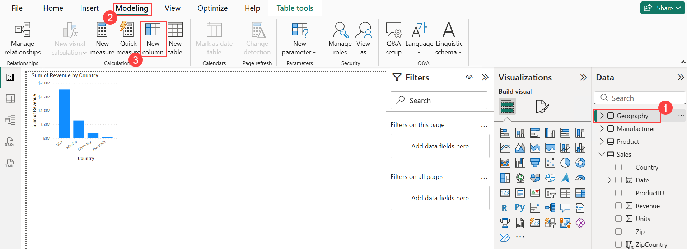

1. A formula bar now appears. Enter the following DAX expression in the formula bar: 

    ```bash
    ZipCountry = Geography[Zip] & "," & Geography[Country]
    ```
          
      
   
1. Click on the **Model (1)** icon on the left panel to navigate to the **Relationship** view and drag the **ZipCountry (2)** field from the **Geography** table and connect it to the **ZipCountry (3)** field in the **Sales** table.

      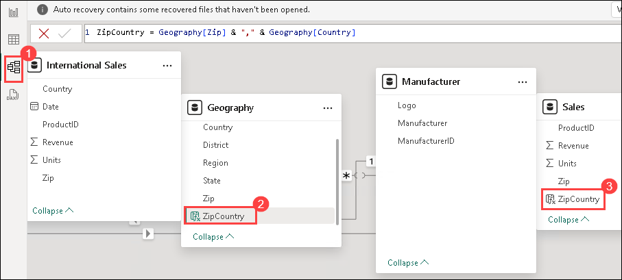

1. On the **New relationship** dialog box, click **Save** to create the relationship.

      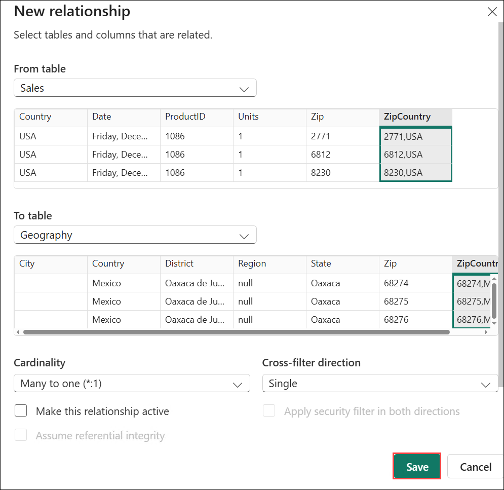
    
1. Click on the **Report** icon on the left panel to navigate to the **Report** view and click on the **ellipsis (1)** on the below right corner of the visual. Click on **Sort axis (2)** and select **Sum of Revenue (3)**.

      

1. From the Data section, **uncheck** the box and **drag** the **Country (1)** field from the **Geography** table to the Filters pane and drop it in **Filters on all pages**. Change Filter type to **Advanced filtering (2)** and from the dropdown, choose **is not blank** **(3)**, click on **Apply Filter (4)**.
 
      

1. Click on the **Model** icon.

1. Drag the **ProductID** field in the **Sales** table to connect the line with the **ProductID** field in the **Product** table and click on **Save**.

   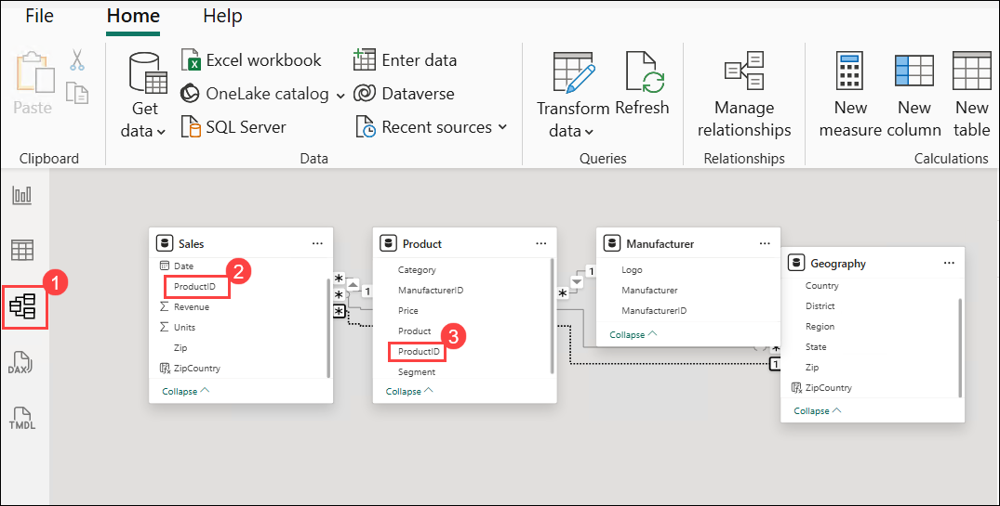

    > **Note:** If you receive an error stating "There's already a relationship between these two columns," kindly repeat this step.

1. Drag the **ManufacturerID** field in the **Manufacturer** table to connect the line with the **ManufacturerID** field in the **Product** table.

      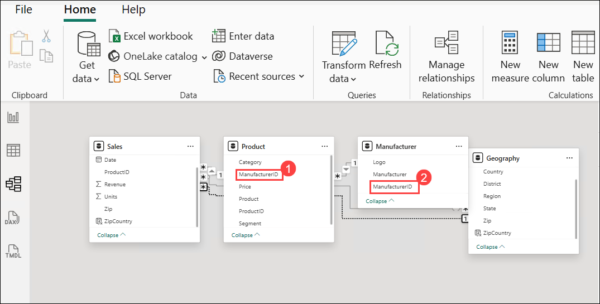

1. Now, click on the **Report** icon on the left panel. From the **Data** section, expand the **Manufacturer** table, and then drag the **Manufacturer (1)** column to the **Legend** section under Visualizations.From the **Visualizations** section, click on the **Stacked column chart (2)** visual.

    - **Note :** Make sure to check the box next to the **Country** field under the **Geography table**, and also check the box next to the **Revenue** field under the **Sales table**.

      

1. Click on the **Ellipsis (1)** on the top right corner of the visual, click on **Sort axis (2)** and select **Sort decending (3)**.

      
    
1. In the **Filters** pane, expand **Manufacturer** and drag under **Filters on this visual**. From the **Filter Type** dropdown menu, click **Top N (1)**. Enter **5 (2)** in the text box next to **Top**. From the **Sales** table, drag and drop the **Sum of Revenue (3)** field into the **By value** section. Click on **Apply filter (4)**.

      

1. Click on the **Format visual (1)** and click on **X axis (2)** and Turn on **Bold** and **Italic** **(3)** feel free to try different formatting options on different areas. For the purpose of the lab, we will turn off Bold and Italic.

    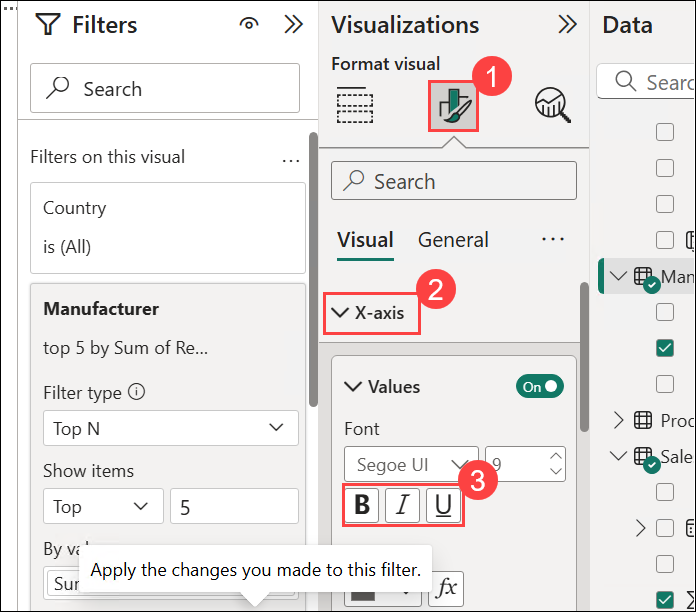

1.  Begin with **Stacked column chart** selected. Hover over and click the **Clear filter** icon (erase) next to **Manufacturer** field in the **Filters** Pane.

      

1. From the **Data** section, right-click on the **Manufacturer (1)** field name from **Manufacturer** table and click **New group (2)**.

      
   
      >**Note**: Do not check the checkbox.

1. On the **Groups tab**, In the **Ungrouped values** section, use the **Ctrl** key to select **Adatum Corporation**, **Consolidated Messenger**, **Contoso, Ltd.**, **Fabrikam, Inc.**, and **Proseware, Inc.** **(1)**, then click **Group (2)** to create a new group under **Groups and members**.

      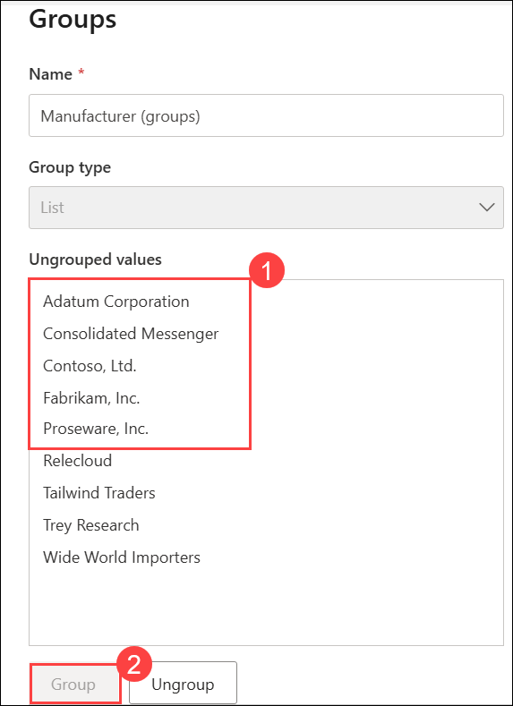

1. Double-click the newly created group and rename it **Top Competitors (3)**. Click **VanArsdel (4)** from the **Ungrouped values** section and click the **Group (5)** button to create the **VanArsdel** group.

      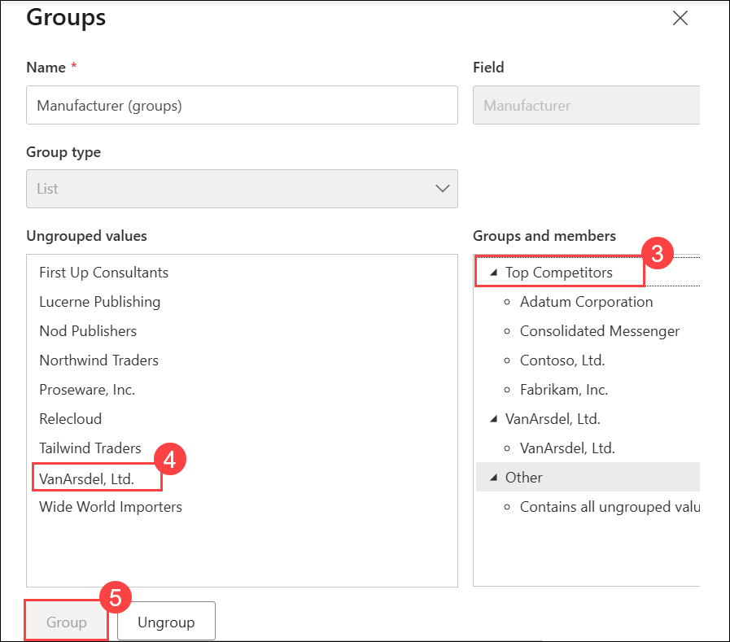
   
1. Click the checkbox **Include Other group (7)**. This will create another **Other** group that includes all the other manufacturers. Click on **OK** to close the **Groups** dialog.

      
    
1. From the **Data** section, drag the newly created **Manufacturer (groups)** to the **Legend** section. Now we can see that VanArsdel has nearly 50% share in USA.

      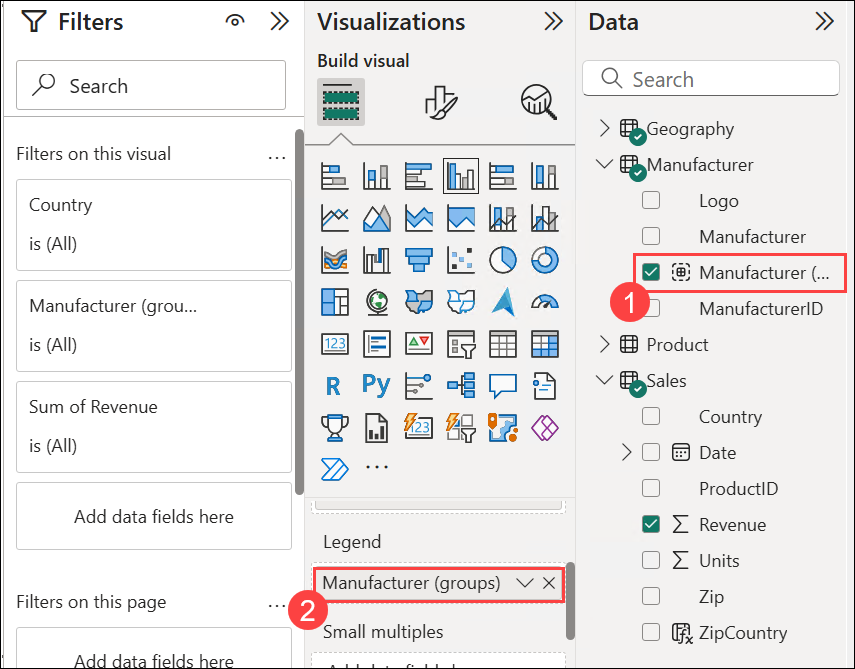

1. Hover over one of the columns and right-click. Click **Show as a table**. You will now be in **Focus** mode with the chart displayed on top and the data displayed below. Notice that VanArsdel has a large percentage of the USA market.

      

1. Click **Back to Report** to go back to the **Report** canvas.

      

1. Click on the white space in the canvas. From the **Data** section, click the checkbox next to the **Revenue (1)** field in the **Sales** table. From the **Data** section, click the checkbox next to the **Manufacturer (2)** field in the **Manufacturer** table. From the **Visualizations** section, click the **Treemap (3)** visual.

      

1. In the **Treemap**, click **VanArsdel** and notice that the Stacked column chart is filtered. This confirms that VanArsdel has a large percentage of the USA market. To remove the filter, click **VanArsdel** again.

1. From the **Data** section, drag **Manufacturer (groups) (1)** from the **Manufacturer** table to the **Filters on this page (2)** box in the **Filters Pane**. Select **Top Competitors** and **VanArsdel** **(3)**.

      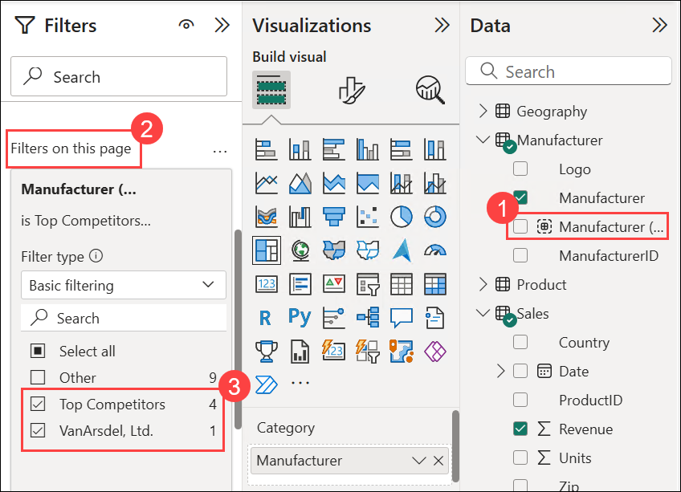

1. Begin by clicking on the white space in the canvas and select **Clusterd column chart (1)** from Visualizations.Click the checkbox next to the **Date (2)** field in the **Sales** table. Click the checkbox next to the **Revenue (3)** in the **Sales** table field.
   
      > **Note:** Notice that a Clustered column chart is created. Also notice in the **Axis** section, a date hierarchy is created. There are arrows on the top bar of the chart which are used to navigate through the hierarchy.

      

1. Click on the **USA** column in the **Revenue by Country** visual.

1. With the **Revenue by Country (1)** visual selected, from the ribbon click on **Format (2)**, and then click **Edit Interactions (3)**. Notice on the top right of the other two visuals, new icons with the highlight icon selected.

      

1. Click the **filter icon** for both visuals.

      
    
      > **Note:** Notice now in both Revenue by Year and Revenue by Manufacturer, data is filtered for USA.

1. Now click the **Revenue by Year** visual. Next, click the **filter** icon on the other two visuals.

      

1. Similarly, click on the **Revenue by Manufacturer** visual and click the **filter icon** on the other **two visuals**. Once you are done, all the visuals should be in filter mode.

      

1. With the **Revenue by Manufacturer (1)** visual selected, from the ribbon click **Format (2)** then **Edit Interactions (3)** to remove the icons.

      

1. Click on **VanArsdel** in the Revenue by Manufacturer visual.

      

1. Click on the **Revenue by Country and Manufacturer (groups) (1)** chart and remove **Manufacturer (groups) (2)** from the legend.

      

1. Click on **VanArsdel** in the **Revenue by Manufacturer** visual.

1. **Ctrl+Click** the **USA column** in the **Revenue by Country** visual. 

      

1. Click the **down arrow (1)** on the top of the **Revenue by Year** visual. Click the **2024 (2)** column in the **Revenue by Year** visual.

      

      

1. Click on the double arrow icon on the top of the **Revenue by Year** visual. This drills down to the next level of the hierarchy, which is the month.

      

      

1. Click on the up-arrow icon on the top of the **Revenue by Year** visual to drill up to the **Quarter** level.

   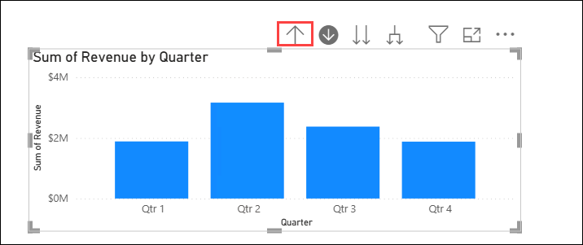

1. Click on the drill-up icon again to go up to the **Year** level

   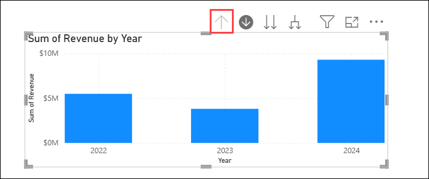

1. Click on the split arrow icon on the top right of the **Revenue by Year** visual. This expands down to the next level of the hierarchy, which is quarters for all the years.

    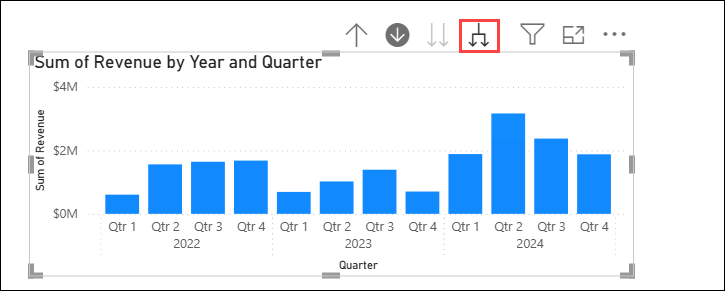

1. Now let’s expand down to the month level. Click on the split arrow icon on the top right of the **Revenue by Year** visual. This expands down to the next level of the hierarchy, which is months for all the years.

    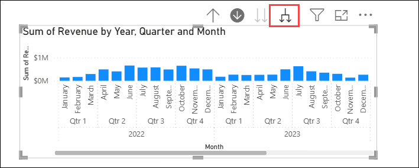

## Summary

In this lab, you have explored the various data in Power BI.

### You have successfully completed the lab!
